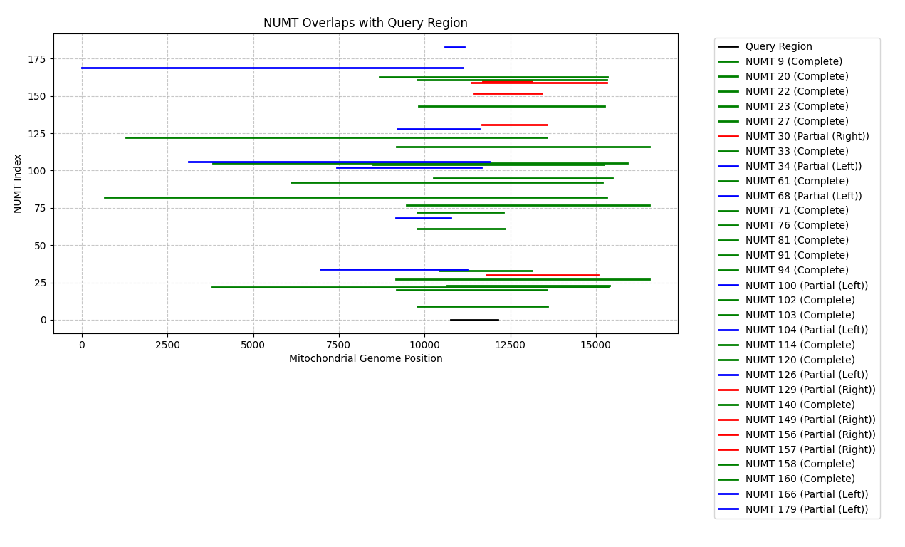

# NUMT Overlap Analysis Tool

A Python tool for analyzing overlaps between Nuclear Mitochondrial DNA Segments (NUMTs) and specific regions of interest in the mitochondrial and nuclear genomes.

## Background

Nuclear mitochondrial DNA segments (NUMTs) are fragments of mitochondrial DNA that have been inserted into the nuclear genome during evolution. These insertions can complicate the interpretation of mitochondrial DNA sequences, particularly in clinical settings. This tool helps identify potential NUMT interference in regions of interest. The list of NUMTs is derived from RHNumtS (Reference Human NumtS) compilation annotating more than 500 Human NumtS: 

Lascaro, D., Castellana, S., Gasparre, G. et al. The RHNumtS compilation: Features and bioinformatics approaches to locate and quantify Human NumtS. BMC Genomics 9, 267 (2008). https://doi.org/10.1186/1471-2164-9-267

## Features

- Identifies complete and partial NUMT overlaps with a query region
- Calculates detailed overlap statistics, including:
  - Exact overlap coordinates
  - Overlap length
  - Percentage of query region covered
  - Type of overlap (Complete, Partial Left, Partial Right, Internal)
- Generates visualizations of overlapping regions
- Exports detailed results to Excel format
- Produces publication-ready figures

## Example Output

### Visualization
The tool generates a clear visualization of NUMT overlaps:



### Color Coding
- Black line: Query region (chrMT:10,761-12,137)
- Green: Complete overlaps
- Blue: Partial left overlaps
- Red: Partial right overlaps
- Purple: Internal overlaps

### Excel Output
Detailed results are exported to an Excel file (`NUMT_overlap_results.xlsx`) containing:
- NumtS Code
- Overlap coordinates
- Overlap length and percentage
- Overlap type classification

## Installation

1. Clone this repository:
```bash
git clone https://github.com/audrainess/NUMT_clinical.git
cd NUMT_clinical
```

2. Install required packages:
```bash
pip install -r requirements.txt
```

## Usage

### Basic Usage
```bash
python numt_overlap_analysis.py
```

The script will analyze overlaps between NUMTs and the default region (chrMT:10,761-12,137).

### Output Files
The tool generates:
1. An Excel file (`NUMT_overlap_results.xlsx`) containing:
   - Detailed overlap information for each NUMT
   - Overlap coordinates and lengths
   - Overlap types and percentages

2. A visualization (`Figure_1.png`) showing:
   - Query region
   - Overlapping NUMTs
   - Color-coded overlap types

## Input Data Format

The tool expects an Excel file with the following columns:
- NumtS Code: Unique identifier for each NUMT
- Chr: Chromosome number
- Mt Start: Mitochondrial start position
- Mt End: Mitochondrial end position
- Mt fragment length: Length of the mitochondrial fragment
- Nuc Start: Nuclear genome start position
- Nuc End: Nuclear genome end position
- Chr fragment length: Length of the chromosomal fragment

## Clinical Usage Disclaimer

⚠️ **Important Notice for Clinical Applications**:
- This tool is provided for research purposes only
- Results should be validated using appropriate clinical methods
- Not intended for direct clinical diagnosis
- Users should follow their institution's guidelines for clinical sequence analysis
- Always validate findings using alternative methods for clinical applications

## Contributing

Contributions are welcome! Please feel free to submit a Pull Request.

## Citation

If you use this tool in your research, please cite:
```
Repository: https://github.com/audrainess/NUMT_clinical
```
